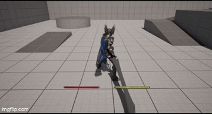
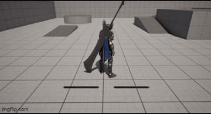

# Project EOS

**Unreal Engine 5.4 | C++ | Gameplay Ability System**


---

본 저장소는 팀 프로젝트에서 제가 직접 작성한 C++ 소스코드만 정리한 저장소입니다.

전체 프로젝트는 SVN으로 관리했으며, 여기에는 제 담당 코드만 포함되어 있습니다.

전투 로직은 최대한 C++에서 처리하고, Blueprint는 Animation 및 데이터 연결 용도로 사용했습니다.

GAS의 Ability / Component 단위 구조를 활용해 입력, 상태, 전투 흐름의 책임을 분리하는 방향으로 작업했습니다.

---

## Preview

### Combo Attack



### Equip



## Tech Stack

- Unreal Engine 5.4
- C++
- Gameplay Ability System (GAS)
- Enhanced Input
- GameplayTag
- Animation Montage / Linked Anim Layer
- GameplayEffect + ExecCalc
- SVN (형상관리)

---

## 담당 코드

```plaintext
Source/ProjectEOS/

├── AbilitySystem/
│   ├── EosAbilitySystemComponent.h / .cpp         # InputTag 기반 Ability 입력 처리
│   ├── EosGameplayAbility.h / .cpp                # GA 공통 기반 클래스
│   ├── EosPlayerGameplayAbility.h / .cpp          # 플레이어 전용 GA 기반 클래스
│   ├── EosAttributeSet.h / .cpp                   # Health / Damage Attribute 관리
│   └── GeExecCalc_DamageTaken.h / .cpp            # ExecCalc 기반 데미지 계산
│
├── Components/
│   ├── Combat/ 
│   │   ├── EosBaseCombatComponent.h / .cpp        # 전투 컴포넌트 기반 클래스
│   │   ├── EosPlayerCombatComponent.h / .cpp      # 무기 장착 / Collision 처리
│   └── Input/
│       ├── EosEnhancedInputComponent.h            # InputTag 기반 Input 바인딩
│       └── EosDataAsset_InputConfig.h / .cpp      # InputAction-InputTag 매핑 DataAsset
│
├── Character/
│   ├── EosBaseCharacter.h / .cpp                  # 캐릭터 공 기반 클래스
│   └── EosBasePlayerCharacter.h / .cpp            # 플레이어 캐릭터 기반 클래스
│
├── PlayerController/
│   └── EosBasePlayerController.h / .cpp           # Input 처리 진입점
│
├── Items/
│   ├── EosBaseWeapon.h / .cpp                     # 무기 Actor 기반 클래스
│   └── EosBasePlayerWeapon.h / .cpp               # 플레이어 무기 기반 클래스
│
├── AnimInstances/
│   ├── EosCharacterAnimInstance.h / .cpp          # 캐릭터 AnimInstance
│   └── EosPlayerLinkedAnimLayer.h / .cpp          # Linked Anim Layer 구조
│
└── DataAssets/
│   ├── EosDataAsset_BaseStartUpData.h / .cpp      # StartUpData 공통 기반 클래스
│   └── EosDataAsset_PlayerStartUpData.h / .cpp    # 초기 Ability / Effect 등록 DataAsset
│
└── Struct/
│   └── EosStructTypes.h                           # 공용 Struct 정의
│
└── Utilities/
    ├── EosGameplayTags.h / .cpp                   # 프로젝트 전역 GameplayTag 선언
    └── EosFunctionLibrary.h / .cpp                # 전역 유틸 함수 라이브러리
```

## System Design

공통 Character 로직은 `EosBaseCharacter`에서 관리하고,

`EosBasePlayerCharacter`에서는 입력 및 플레이어 전용 기능을 처리하도록 분리했습니다.

### Ability Initialization

공통 등록 로직은 `EosDataAsset_BaseStartUpData`에서 관리하고,

플레이어 전용 Ability 구성은 `EosDataAsset_PlayerStartUpData`에서 처리합니다.

### GameplayTag 기반 상태 관리

GameplayTag를 단순 분류 용도가 아니라

상태 관리 / 입력 식별 / Ability 실행 / 전투 이벤트 전달까지 일관되게 사용했습니다.

전역 Tag는 `EosGameplayTags`에서 한곳에 선언해 문자열 하드코딩 없이 참조할 수 있도록 했습니다.

```
Input
 └─ InputTag (InputTag_Attack, InputTag_Guard)
     └─ ASC Ability 검색
         └─ 상태 Tag 실행 여부 판단 (Player_Status_Guarding 등)
             └─ GameplayEvent 전달 (Common_Event_MeleeHit)
```

### Enhanced Input + GAS 입력 구조

`EosEnhancedInputComponent`에서 InputAction을 InputTag로 바인딩하고,

`EosAbilitySystemComponent`에서 해당 Tag로 Ability를 검색해 활성화합니다.

Controller가 개별 Ability를 직접 참조하지 않아 무기 교체 시 InputMappingContext만 교체하면 입력 구조 전체가 전환됩니다.
```plaintext
InputAction
└─ EosEnhancedInputComponent
└─ EosAbilitySystemComponent (InputTag → Ability 검색)
└─ Ability 실행
```
InputAction ↔ InputTag 매핑은 `EosDataAsset_InputConfig`로 관리합니다.

### Combo Flow

GameplayTag + Timer + Montage Notify 조합으로 설계했습니다.

실제 입력 허용 타이밍은 Montage Notify가 열어주고,

그 안에서 입력이 들어오면 ComboCount를 올려 다음 Ability로 이어집니다.
```plaintext
Attack Ability 실행
└─ Combo Timer 시작 (ComboContinueTime)
└─ Montage Notify → 입력 허용 구간 개방
└─ InputTag_Continue 감지 → ComboCount 증가
└─ 다음 Attack Ability 실행
```

### Equip 상태 기반 Ability 전환

무기를 장착하면 `EosPlayerCombatComponent`가 WeaponTag를 갱신하면서

Ability 부여 / InputMappingContext 전환 / Linked Anim Layer 기반 애니메이션 구조 연동이 함께 처리됩니다.

무기별로 Ability와 입력 구조를 독립적으로 구성할 수 있습니다.
```plaintext
Weapon Equip
└─ CurrentEquippedWeaponTag 변경
├─ Weapon Ability 부여 (GAS Grant)
├─ InputMappingContext 전환
└─ EosPlayerLinkedAnimLayer 전환
```

### Damage Calculation

데미지 계산은 `GeExecCalc_DamageTaken`에 분리했습니다.

Ability에서 EffectSpec을 생성하고 SetByCaller로 수치를 넘기면,

ExecCalc에서 AttackPower / DefensePower / ComboCount / AttackType을 종합해

`EosAttributeSet`의 Health에 반영합니다.
```plaintext
Weapon Hit
└─ GameplayEffectSpec 생성 (EosGameplayAbility)
└─ SetByCaller 데이터 전달
└─ GeExecCalc_DamageTaken
└─ EosAttributeSet Health 반영
```
---

## Overall Combat Flow
```plaintext
Input
└─ EosEnhancedInputComponent
   └─ InputTag
      └─ EosAbilitySystemComponent
         └─ EosPlayerGameplayAbility
            └─ CommitAbility
               └─ Montage Play
                  └─ Weapon Collision
                     └─ GameplayEvent (Common_Event_MeleeHit)
                        └─ GameplayEffect
                           └─ GeExecCalc_DamageTaken
                              └─ EosAttributeSet
                                 └─ Health 반영
                                    └─ Dead State
```
---

## Core Classes

| Class | 역할 |
|---|---|
| `EosGameplayAbility` | GA 공통 기반. EffectSpec 생성, GameplayEvent 처리 |
| `EosBaseCharacter` | EosBaseCharacter / Character 공통 기능 및 ASC 연결 기반 클래스 |
| `EosPlayerGameplayAbility` | 플레이어 전용 GA. PlayerCharacter / Controller 참조 제공 |
| `EosAbilitySystemComponent` | InputTag 기반 Ability 검색 및 활성화 |
| `EosAttributeSet` | Health / Damage Attribute 정의 및 변경 처리 |
| `GeExecCalc_DamageTaken` | ExecCalc 데미지 계산 로직 |
| `EosPlayerCombatComponent` | 무기 장착 상태 관리, Weapon Collision 처리 |
| `EosEnhancedInputComponent` | InputTag 기반 Input 바인딩 |
| `EosDataAsset_InputConfig` | InputAction ↔ InputTag 매핑 |
| `EosDataAsset_BaseStartUpData` | StartUpData 공통 기반 클래스 |
| `EosDataAsset_PlayerStartUpData` | Player 초기 Ability / Effect 등록 |
| `EosGameplayTags` | 프로젝트 전역 GameplayTag 선언 |
| `EosFunctionLibrary` | GAS 관련 전역 유틸 함수 |
| `EosStructTypes` | 공용 Struct 정의 |
